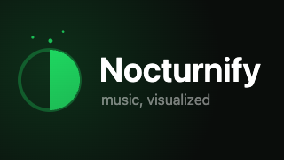

# Nocturnify

A few-hundred-KB music front end for Android TV: one WebView, the official
[Spotify Web Playback SDK](https://developer.spotify.com/documentation/web-playback-sdk)
for audio, a D-pad-first UI, and a full-screen visualizer that pulls its palette from the
album art. No offline cache, no video, no podcasts UI.

Built because the official Android TV app is heavier than an older set has to spare. The TV
also registers as a Spotify Connect device, so a phone works as a remote.

**Requires Spotify Premium** — the Web Playback SDK refuses free accounts.

## Visualizer

Nine modes plus a hidden tenth. Colours are quantised out of the current album art, with
buckets weighted by saturation and luminance so near-black covers still yield usable accents.

| | |
|---|---|
| **Drift** | slow ambient particle field |
| **Orbit** | concentric rotating shells |
| **Aurora** | vertical curtains |
| **Nebula** | billowing cloud |
| **Starfield** | forward flight, with occasional comets |
| **Ribbons** | flowing bands |
| **Lattice** | connected node mesh |
| **Bloom** | rings that grow, destabilise, and drift off the perimeter |
| **Rain** | wind-blown streaks of varying weight |
| **Auto** | cross-fades between all nine — hidden slot, reached by paging past either end |

Press ◀ or ▶ inside the visualizer to change mode. It enters automatically after 60 s idle.

## One-time setup

1. Go to <https://developer.spotify.com/dashboard> → **Create app**.
   - Redirect URI (exactly): `https://appassets.androidplatform.net/assets/callback.html`
   - API: tick **Web Playback SDK** and **Web API**.
2. `cp app/src/main/assets/config.example.js app/src/main/assets/config.js` and paste your
   **Client ID** into it. That file is gitignored — each install uses its own registration.
3. Add your Spotify account under **User Management** in the dashboard. New apps start in
   Development Mode, which is limited to a handful of allowlisted users.
4. Build, install, and sign in with email + password. *Continue with Google* is blocked
   inside Android WebViews by Google, not by this app.

## Build

```bash
export JAVA_HOME=/opt/homebrew/opt/openjdk@17    # any JDK 17
export ANDROID_HOME=$HOME/Library/Android/sdk
./gradlew assembleDebug

adb connect <tv-ip>:5555
adb -s <tv-ip>:5555 install -r app/build/outputs/apk/debug/app-debug.apk
```

## Remote

| Key | Action |
|---|---|
| ▲ ▼ | move within the list |
| ◀ ▶ | switch between sidebar and list; change mode inside the visualizer |
| OK | open / play; play-pause inside the visualizer |
| Back | up a level; at the top, exit |
| Play/Pause | transport |
| ⏭ ⏮ | tap to change track, hold to seek |

## Diagnostics

```bash
# Widevine / EME gate — must report "WIDEVINE OK" or nothing else will work
adb shell am start -n dev.rich.spotifytv/.MainActivity -e page eme-test.html

# JS console
adb logcat -s SpotifyTV
```

## Layout

```
app/src/main/java/.../MainActivity.kt    WebView, DRM permission grant, OAuth redirect capture
app/src/main/java/.../PlaybackService.kt foreground media service — audio survives leaving the app
app/src/main/assets/
  index.html  style.css  app.js          the UI
  viz.js                                 the visualizer
  auth.js  callback.html                 OAuth PKCE; tokens live in localStorage
  config.js                              your Client ID (gitignored)
  eme-test.html                          Widevine gate page
```

## Known limits

- **Shuffle is read-only in playlist contexts.** Spotify accepts the request, returns 200, and
  ignores it; `actions.disallows.toggling_shuffle` is set. The UI reports it as locked.
- **~0.8 s gap between tracks.** Each track gets its own Widevine session: the old one closes,
  the decoder and AudioTrack are torn down, a new session opens and fetches a licence, then the
  pipeline restarts — all serially, inside Chromium. Not something this app can reach.
- **Development Mode caps you at a few users** until Spotify grants an extension.

## Licence

MIT — see [LICENSE](LICENSE).

Not affiliated with, endorsed by, or sponsored by Spotify AB. *Spotify* is a trademark of
Spotify AB. This project is an independent client built on their public developer APIs.
