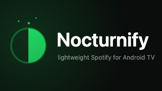

# Nocturnify

A lightweight Spotify client for Android TV: one WebView, the official
[Web Playback SDK](https://developer.spotify.com/documentation/web-playback-sdk) for audio,
a D-pad-first UI, and a full-screen visualizer that takes its palette from the album art.

Built because the official Android TV client is heavier than an older set has to spare — a
**6.9 MB APK against 210 MB installed**. The TV also registers as a Spotify Connect device,
so a phone works as a remote.

**Requires Spotify Premium** — the Web Playback SDK refuses free accounts.

## Docs

| | |
|---|---|
| [Architecture](docs/architecture.md) | why a WebView, the secure origin, PKCE, background audio, platform limits |
| [Visualizer](docs/visualizer.md) | all ten modes, the palette quantiser, performance findings |
| [Footprint](docs/footprint.md) | measured disk and memory, against the official app |
| [Troubleshooting](docs/troubleshooting.md) | Widevine gate, sign-in, shuffle, overscan |

## Setup

1. <https://developer.spotify.com/dashboard> → **Create app**.
   - Redirect URI, exactly: `https://appassets.androidplatform.net/assets/callback.html`
   - API: tick **Web Playback SDK** and **Web API**.
2. `cp app/src/main/assets/config.example.js app/src/main/assets/config.js` and paste your
   **Client ID**. That file is gitignored — every install uses its own registration.
3. Add your account under **User Management**. New apps start in Development Mode, which is
   limited to a handful of allowlisted users.
4. Build, install, sign in with email + password. *Continue with Google* is blocked inside
   Android WebViews by Google, not by this app.

## Build

```bash
export JAVA_HOME=/opt/homebrew/opt/openjdk@17    # any JDK 17
export ANDROID_HOME=$HOME/Library/Android/sdk
./gradlew assembleDebug

adb connect <tv-ip>:5555
adb -s <tv-ip>:5555 install -r app/build/outputs/apk/debug/app-debug.apk
```

## Remote

| Key | Action |
|---|---|
| ▲ ▼ | move within the list |
| ◀ ▶ | switch between sidebar and list; change mode inside the visualizer |
| OK | open / play; play-pause inside the visualizer |
| Back | up a level; at the top, exit |
| Play/Pause | transport |
| ⏭ ⏮ | tap to change track, hold to seek |

## Visualizer

Ten modes — Drift, Orbit, Aurora, Nebula, Starfield, Ribbons, Lattice, Bloom, Rain, and a
hidden **Auto** that cross-fades through all nine. Colours are quantised from the current
album art. Every mode holds 0.00% jank at ~8 ms a frame on a 2019 MediaTek TV SoC.

Details and the performance work in [docs/visualizer.md](docs/visualizer.md).

## Layout

```
app/src/main/java/.../MainActivity.kt     WebView, DRM permission grant, OAuth redirect capture
app/src/main/java/.../PlaybackService.kt  foreground media service — audio survives leaving the app
app/src/main/assets/
  index.html  style.css  app.js           the UI
  viz.js                                  the visualizer
  auth.js  callback.html                  OAuth PKCE; tokens in localStorage
  config.js                               your Client ID (gitignored)
  eme-test.html                           Widevine gate page
```

## Licence

MIT — see [LICENSE](LICENSE).

Not affiliated with, endorsed by, or sponsored by Spotify AB. *Spotify* is a trademark of
Spotify AB. This is an independent client built on their public developer APIs.
